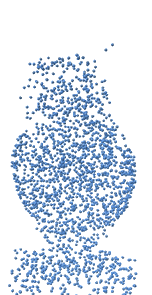
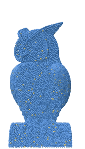
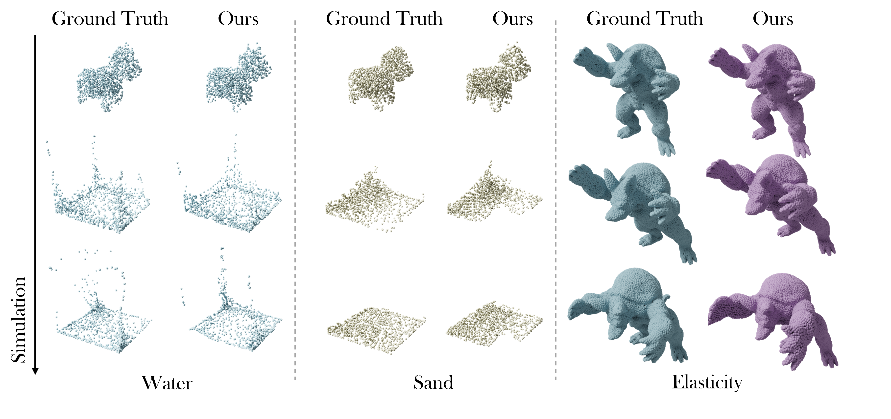

# Reduced-Order Neural Operators: Learning Lagrangian Dynamics on Highly Sparse Graphs, 2024
## [Hrishikesh Viswanath](https://hrishikeshvish.github.io), [Chang Yue](https://changy1506.github.io/), [Julius Berner](https://jberner.info/), [Peter Yichen Chen](https://peterchencyc.com/), [Aniket Bera](https://www.cs.purdue.edu/homes/ab/)

#### [Arxiv](https://arxiv.org/pdf/2407.03925) | [Project Page](https://hrishikeshvish.github.io/projects/giorom.html) | [Saved Weights](https://drive.google.com/drive/folders/1CWMdqKaCtLy8KhA-DIBpS07M6CSuMjgQ?usp=sharing) | [Data](https://sites.google.com/view/learning-to-simulate)


    @article{viswanath2024reduced,
      title={Reduced-Order Neural Operators: Learning Lagrangian Dynamics on Highly Sparse Graphs},
      author={Viswanath, Hrishikesh and Chang, Yue and Berner, Julius and Chen, Peter Yichen and Bera, Aniket},
      journal={arXiv preprint arXiv:2407.03925},
      year={2024}
    }


<p align="center">
  

  
   <br>
  
</p>
<p><em>Neural Operator Inference &emsp;&emsp;&emsp;&emsp; Discretization Agnostic FOM Inference &emsp;&emsp;&emsp;&emsp;&emsp;&emsp;Final Rendering</em></p>


# Abstract
> We present a neural operator architecture to simulate Lagrangian dynamics, such as fluid flow, granular flows, and elastoplasticity. Traditional numerical methods, such as the finite element method (FEM), suffer from long run times and large memory consumption. On the other hand, approaches based on graph neural networks are faster but still suffer from long computation times on dense graphs, which are often required for high-fidelity simulations. Our model, GIOROM or Graph Interaction Operator for Reduced-Order Modeling, learns temporal dynamics within a reduced-order setting, capturing spatial features from a highly sparse graph representation of the input and generalizing to arbitrary spatial locations during inference. The model is geometry-aware and discretization-agnostic and can generalize to different initial conditions, velocities, and geometries after training. We show that point clouds of the order of 100,000 points can be inferred from sparse graphs with $\sim$1000 points, with negligible change in computation time. We empirically evaluate our model on elastic solids, Newtonian fluids, Non-Newtonian fluids, Drucker-Prager granular flows, and von Mises elastoplasticity. On these benchmarks, our approach results in a 25$\times$ speedup compared to other neural network-based physics simulators while delivering high-fidelity predictions of complex physical systems and showing better performance on most benchmarks. The code and the demos are provided at (https://github.com/HrishikeshVish/GIOROM).

# Instructions to Use the Code

#### After downloading the repo, and from the parent directory. Install dependencies:

    conda create --name <env> --file requirements.txt

#### Download the dataset and Create a folder:

    mkdir giorom_datasets
    mkdir <datasetname>

For each dataset, there should be 4 files within the dataset directory. In some cases there's a fifth file rollout_full, which is the full pointcloud (not sampled). Typically, rollout.pt contains sampled points for space efficiency. For small datasets such as WaterDrop2D, the full point cloud has ~2000 points and does not contain a rollout_full.pt. For example, nclaw_Water would look something like this

    giorom_datasets/nclaw_Water/metadata.json
    giorom_datasets/nclaw_Water/rollout_full.pt
    giorom_datasets/nclaw_Water/test.pt
    giorom_datasets/nclaw_Water/train.obj
    giorom_datasets/nclaw_Water/rollout.pt

We provide code to process datasets provided by GNS [1] and NCLAW [2]

- [1] Sanchez-Gonzales+ Learning to Simulate Complex Physics with Graph Neural Networks
- [2] Ma+ Learning neural constitutive laws from motion observations for generalizable pde dynamics

#### Dataset preprocessing:

    cd Dataset\ Parsers/
    python parseData.py --data_config nclaw_Sand
    python parseData.py --data_config WaterDrop2D

#### Preparing NCLAW datasets

The dt used for the simulations is 5e-3. During generation, this can be set in ```configs/sim/high.yaml```, ```configs/sim/low.yaml```. Alternatively, after generating, every tenth frame can be used in the train dataset

Each material has a hard-coded geometry. This can be found in ```configs/env/blob/armadillo.yaml```, ```configs/env/blob/bunny.yaml``` etc. The defaults can be changed to ```jelly```, ```sand```, ```water```, ```plasticine```. In the file ```nclaw/constants.py``` you can add shapes to ```SHAPE_ENVS``` dictionary. eg. ```'jelly':['bunny', 'armadillo', 'spot', 'blub']```. While generating, this will generate trajectories for all the geometries. To randomize the trajectories, ```config/env/blob/"shape".yaml``` has a parameter called ```override vel```. This can be set to random. Inside ```configs/env/blob/vel/random.yaml```, the seed can be changed to change the initial velocity, altering the trajectory. This can be done manually or within ```eval.py```

    state_root: Path = exp_root / f'state_{seed}' #Add the seed in foldername to create new folders for each trajectory so that the paths look like this /material/shape/armadillo/state_{seed}
    for blob, blob_cfg in sorted(cfg.env.items()):
        blob_cfg.vel['seed'] = seed # Add this line
        

The config files are formatted in a slightly different way, but this can be changed depending on how the dataset is generated. In the below structure, shape_1 and shape_2 refer to two different "runs", generated with different random velocity seeds, 

    water
        - shape_1
            - armadillo
                - state
                    - 0000.pt   #System state at t0
                    - 0001.pt   #System state at t1
                    ...
                - pv
            - blub
            - bunny
            - spot
        - shape_2

    

All the config paths provided are for reference and need to be updated before they can be used. 

#### Train a time-stepper model from the config:

    python train.py --train_config train_configs_nclaw_Water

#### Train a time-stepper model with args:

    python train.py --batch_size 2 --epoch 100 --lr 0.0001 --noise 0.0003 --eval_interval 1500 --rollout_interval 1500 --sampling true --sampling_strategy fps --graph_type radius --connectivity_radius 0.032 --model giorom2d_large --dataset WaterDrop2D --load_checkpoint true --ckpt_name giorom2d_large_WaterDrop2D --dataset_rootdir giorom_datasets/

#### Evaluate a time-stepper model (Untested code):

    python eval.py --eval_config train_configs_Water2D

We have not provided the code to save the rollout output as a pytorch tensor. However, this snippet can be found at ```eval_3d.ipynb```
To render the results with Polyscope or Blender Use the following. This part of the code needs to be modified and appropriate paths need to be provided in the code

    cd Viz
    python createObj.py
    python blender_rendering.py

### Full-Order inference 
We have split the training of the time-stepper model and the full-order inference model. The two can be combined and trained end-to-end but the split setup requires less compute resources. To train the FOM model, the full-order ground truth sequences are provided to the dataloader. The loader creates Q-point-discretizations, which is provided to the model as input. The sampling strategies and ratios can be tuned in the config file

    python train_fom.py --train_config train_configs_nclaw_Water_FOM.yaml

We provide a demo script that creates an arbitrary Q-point discretization of the input sequence, which is passed to the model. However, in practice, the input to the model will be the output of the time-stepper model 

    python infer_fom_demo.py --train_config train_configs_nclaw_Contact_FOM.yaml
    

# Datasets
We support existing datasets provided by GNS and have new dataset curated from NCLAW framework.
The NCLAW Datasets can be generated using the simulator [NCLAW](https://github.com/PingchuanMa/NCLaw). Our model supports all the materials used in NCLAW. 

### Currently tested datasets from Learning to Simulate Complex Physics with Graph Neural Networks (GNS)

* `{DATASET_NAME}` one of the datasets following the naming used in the paper:
  * `WaterDrop`
  * `Water`
  * `Sand`
  * `Goop`
  * `MultiMaterial`
  * `Water-3D`
  * `Sand-3D`
  * `Goop-3D`
 
Datasets are available to download via:

* Metadata file with dataset information (sequence length, dimensionality, box bounds, default connectivity radius, statistics for normalization, ...):

  `https://storage.googleapis.com/learning-to-simulate-complex-physics/Datasets/{DATASET_NAME}/metadata.json`

* TFRecords containing data for all trajectories (particle types, positions, global context, ...):

  `https://storage.googleapis.com/learning-to-simulate-complex-physics/Datasets/{DATASET_NAME}/{DATASET_SPLIT}.tfrecord`

Where:

* `{DATASET_SPLIT}` is one of:
  * `train`
  * `valid`
  * `test`

##### Note: We have included the code to convert tfrecord to pytorch tensor in our repository, within ```Dataset Parsers```

# Discretization Invariance and Generalizability




# Comparison Against Reduced-Order-Modelling Approaches


# Different Graph Construction methods and Sampling Strategies supported in the codebase


# Long Simulation Examples

